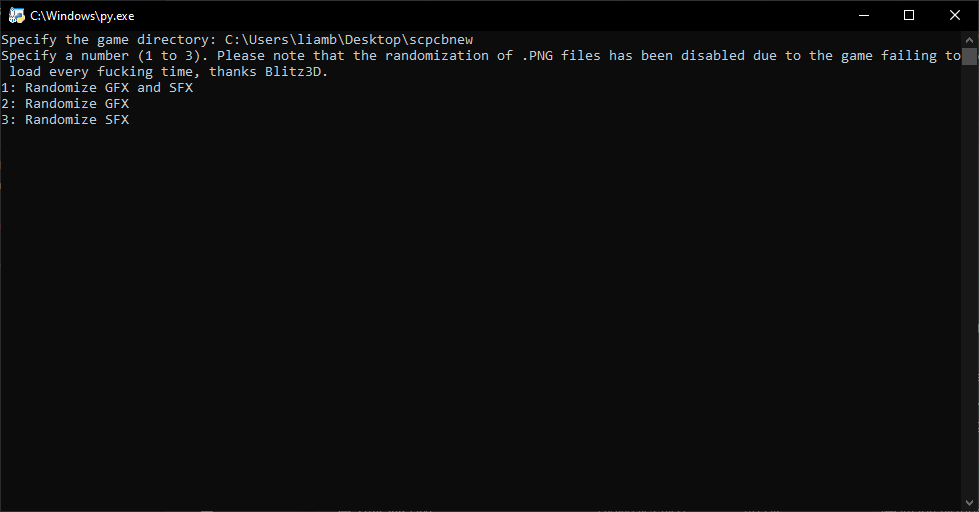

# SCP-CB-Randomizer
SCP: Containment Breach randomizer made in Python.

Requires Python 3.11+ https://www.python.org/downloads/release/python-3115/

Entirely made for fun

Features GFX and SFX randomizer with auto backup

    TODO: Add feature for custom user assets at some point, figure out why randomizing .png files crashes the game, loading screen and possible model randomization (latter probably not possible)

Randomize twice or more for best results

